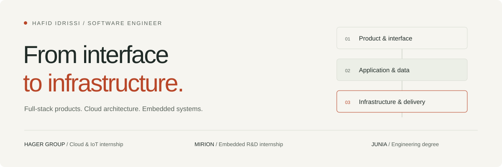

# Hafid Idrissi — Engineering Portfolio

A portfolio built around engineering decisions: private cloud architecture, full-stack products and software that keeps data on the user's device.

**[Explore the site](https://hafididrissi.github.io/)** · **[GitHub profile](https://github.com/HafidIdrissi)** · **[CV in English](https://hafididrissi.github.io/assets/pdf/Hafid_Idrissi_CV.pdf)**



## What is inside

- **Three concise case studies:** Hager Group's Azure proof of concept, CheckAI's application architecture and GoEditPDF's browser-based document processing.
- **The full career record:** 21 entries with explicit internship, employment, independent project and research labels. Filters and native disclosures make the details easy to explore.
- **Selected source code:** six repositories, plus direct links to GitHub, LinkedIn and the CV PDFs.
- **A shared visual identity:** responsive layouts, system-aware light and dark themes, static GitHub banners and social sharing artwork.

## Run locally

No package installation or frontend build is needed to serve the site. Python is only used to regenerate its content.

```bash
python tools/build_site.py
python -m http.server 8777 --bind 127.0.0.1
```

Open [localhost:8777](http://127.0.0.1:8777/).

## Edit and rebuild

| File | Purpose |
| :--- | :--- |
| `index.html` | Page structure, introduction, engineering approach, skills and contact copy |
| `assets/site.css` | Responsive layout, light and dark themes, focus styles and print rules |
| `assets/site.js` | Theme preference, experience filters, direct-link expansion and print state |
| `data/cv-site.json` | Experience, case-study summaries and repository selection |
| `tools/build_site.py` | Renders the `WORK`, `FILTERS`, `TIMELINE` and `REPOS` blocks into static HTML |
| `github-profile-README.md` | Matching copy of the profile repository's `README.md` |
| `tools/build_brand_assets.py` | Generates the light/dark profile banners and social sharing SVG |
| `data/cv-print.json` | Separate English and French print CV content |
| `tools/build_cv.py` | Regenerates the CV PDFs using headless Chrome |

Edit experience and project summaries in `data/cv-site.json`, then run `python tools/build_site.py`. Keep the generated-block markers in `index.html` intact. Rebuilding is deterministic; it should not introduce a second diff.

The full repository list stays in the data file. `featured_repos` selects the six shown on the page; `selected_work` links each case study to an existing experience by ID.

The profile lives in a separate repository, [`HafidIdrissi/HafidIdrissi`](https://github.com/HafidIdrissi/HafidIdrissi). Keep its `README.md` and `assets/profile-header-{light,dark}.svg` in sync with the matching files here when publishing changes to both repositories.

## Content standards

Career claims come from the audited `cv_master_Hafid_IDRISSI.json` held outside this repository, supporting repositories and internship reports. The site data was reviewed in August 2026.

Keep roles, dates, project stages and limitations explicit. Do not invent impact metrics or describe a prototype as a production deployment. Case studies summarise the supporting experience; they do not add new achievements. The current Time Tracker signing notes take precedence over the older description of a signed installer.

## Accessibility and resilience

The content is served as HTML, including every experience. Without JavaScript, all entries remain available through native `<details>` elements, and inactive JavaScript controls are hidden. Direct links reveal the requested experience even when the current filter would hide it.

The page includes a skip link, visible keyboard focus, reduced-motion support, system theme detection and a locally remembered theme choice. Printing opens all experience entries and restores the reader's view afterwards. There are no analytics scripts or live GitHub-statistics dependencies. Google Fonts are optional; system fonts are the fallback.

Check mobile and desktop layouts, both themes, keyboard navigation, filters, direct experience links, no-JavaScript behavior and both CV downloads when changing the layout or behavior.

## CV and sharing assets

```bash
python tools/build_cv.py       # both languages
python tools/build_cv.py en    # English only
python tools/build_brand_assets.py
```

The print CVs are separate from the website layout. Keep their text selectable and their length at two pages.

GitHub Pages is case-sensitive. The tracked English CV is `assets/pdf/Hafid_Idrissi_CV.pdf`; use that exact spelling in links even if a Windows directory listing shows different casing.

`assets/social-preview.png` is the 1200 × 630 raster version of `assets/social-preview.svg`. Refresh the PNG after editing the sharing artwork. The profile banners are static SVGs, with no remote rendering service or animation dependency.

## Reuse

The page code is reusable. Career content, personal documents and personal imagery are not included in that permission.
