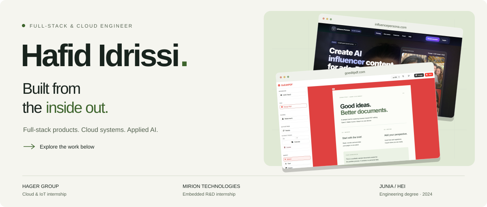

# Hafid Idrissi — Engineering Portfolio

A portfolio built around engineering decisions: private cloud architecture, full-stack products and software that keeps data on the user's device.

**[Explore the site](https://hafididrissi.github.io/)** · **[GitHub profile](https://github.com/HafidIdrissi)** · **[CV in English](https://hafididrissi.github.io/assets/pdf/Hafid_Idrissi_CV.pdf)**



## What is inside

- **Three visual project cards:** Hager Group, CheckAI and GoEditPDF, with expandable case studies.
- **The full career record:** 21 entries with explicit internship, employment, independent project and research labels. Filters and native disclosures make the details easy to explore.
- **Selected source code:** three repositories, plus direct links to GitHub, LinkedIn and the CV PDFs.
- **A shared visual identity:** animated engineering diagrams, light and dark themes, and a compact GitHub profile with four project cards.

## Run locally

No package installation or frontend build is needed to serve the site. Python is only used to regenerate its content.

```bash
python tools/build_site.py
python -m http.server 8777 --bind 127.0.0.1
```

Open [localhost:8777](http://127.0.0.1:8777/).

## Edit and rebuild

| File | Purpose |
| :--- | :--- |
| `index.html` | Page structure, introduction, skills and contact copy |
| `assets/site.css` | Responsive layout, light and dark themes, focus styles and print rules |
| `assets/motion.css` | Animated diagrams, hover effects, responsive adjustments and motion fallbacks |
| `assets/site.js` | Theme and motion preferences, filters, scroll entrances, direct links and print state |
| `data/cv-site.json` | Experience, case-study summaries and repository selection |
| `tools/build_site.py` | Renders the `WORK`, `FILTERS`, `TIMELINE` and `REPOS` blocks into static HTML |
| `github-profile-README.md` | Matching copy of the profile repository's `README.md` |
| `tools/build_brand_assets.py` | Generates the light/dark profile banners and social sharing SVG |
| `tools/build_motion_assets.py` | Generates animated profile diagrams and reduced-motion header alternatives |
| `data/cv-print.json` | Separate English and French print CV content |
| `tools/build_cv.py` | Regenerates the CV PDFs using headless Chrome |

Edit experience and project summaries in `data/cv-site.json`, then run `python tools/build_site.py`. Keep the generated-block markers in `index.html` intact. Rebuilding is deterministic; it should not introduce a second diff.

The full repository list stays in the data file. `featured_repos` selects the three shown on the page; `selected_work` links each card to an existing experience by ID. Its `highlight` is the short visible summary; the longer case study is expandable. Four experience entries are selected by default; all 21 remain available.

The profile lives in a separate repository, [`HafidIdrissi/HafidIdrissi`](https://github.com/HafidIdrissi/HafidIdrissi). Keep its `README.md` in sync with `github-profile-README.md`. The motion asset generator can copy its outputs to the profile repository using `--profile-root PATH`.

## Content standards

Career claims come from the audited `cv_master_Hafid_IDRISSI.json` held outside this repository, supporting repositories and internship reports. The site data was reviewed in August 2026.

Keep roles, dates, project stages and limitations explicit. Do not invent impact metrics or describe a prototype as a production deployment. Case studies summarise the supporting experience; they do not add new achievements. The current Time Tracker signing notes take precedence over the older description of a signed installer.

## Accessibility and resilience

The content is served as HTML, including every experience. Without JavaScript, all entries remain available through native `<details>` elements, and inactive JavaScript controls are hidden. Direct links reveal the requested experience even when the current filter would hide it.

The page includes a skip link, keyboard focus, system-aware themes and an animation pause button. Theme and pause preferences are remembered locally. System reduced-motion preferences disable animation, and entrances never hide content when JavaScript fails. Printing opens all experience entries and case studies and restores the reader's view afterwards. No analytics or live statistics services are used; Google Fonts have system-font fallbacks.

The GitHub SVGs animate without scripts, external fonts or third-party rendering services. Every diagram has an explicit still-image source for reduced motion. Alt text and HTML project descriptions keep essential information accessible.

Check mobile and desktop layouts, both themes, keyboard navigation, filters, direct experience links, no-JavaScript behavior and both CV downloads when changing the layout or behavior.

## CV and sharing assets

```bash
python tools/build_cv.py       # both languages
python tools/build_cv.py en    # English only
python tools/build_brand_assets.py
python tools/build_motion_assets.py
# Optional: also sync the separate profile repository's generated assets
python tools/build_motion_assets.py --profile-root ../HafidIdrissi
```

The print CVs are separate from the website layout. Keep their text selectable and their length at two pages.

GitHub Pages is case-sensitive. The tracked English CV is `assets/pdf/Hafid_Idrissi_CV.pdf`; use that exact spelling in links even if a Windows directory listing shows different casing.

`assets/social-preview.png` is the 1200 × 630 raster version of `assets/social-preview.svg`. Refresh the PNG after editing the sharing artwork. Social sharing artwork stays static; the profile uses separate animated SVGs.

## Reuse

The page code is reusable. Career content, personal documents and personal imagery are not included in that permission.
